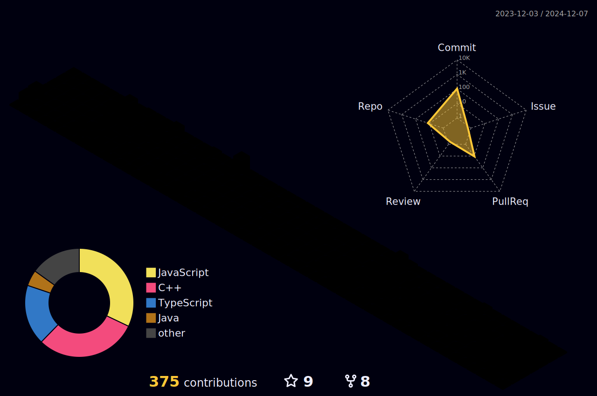

<h1 align="center">Hi 👋, I'm Shobhit Kushwaha</h1>

- 👨‍💻 All of my projects are available at [shobhitkushwaha.co](https://shobhitkushwaha.co)

- 📫 How to reach me **shobhitkushwaha1406@gmail.com**

 

# 💻 Tech Stack:

 
 

 

  
 

  
 
         
 

 

# 📊 GitHub Stats:

 

 

[]

 

# 🔗 Connect with me

---

